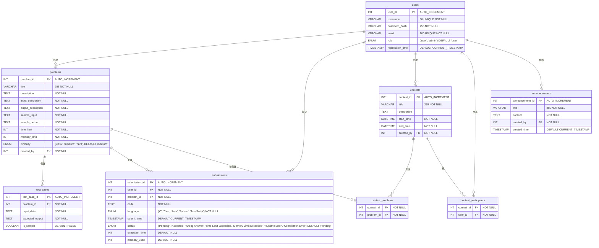

# Online Judge Website based on ASP.NET Framework

## To do List
- [X] 主要处理数据库链接的代码
- [X] 注册页面数据库链接
- [X] 注册页面验证
- [X] 传cookie
- [X] 登录数据库验证
- [X] 读取数据库特定题目生成对应题目页面
- [X] 导入Markdig库,创建markdown_to_html类
- [X] markdown转页面
- [ ] 后端运行代码并返回是否ac
- [ ] 各页面读取cookie中内容并显示是否登录

# DataBase E-R

